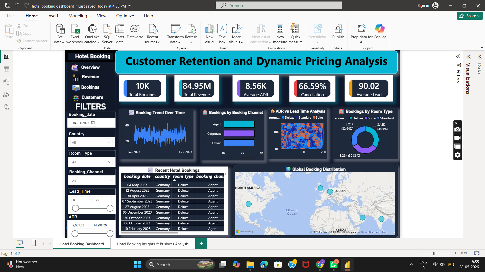
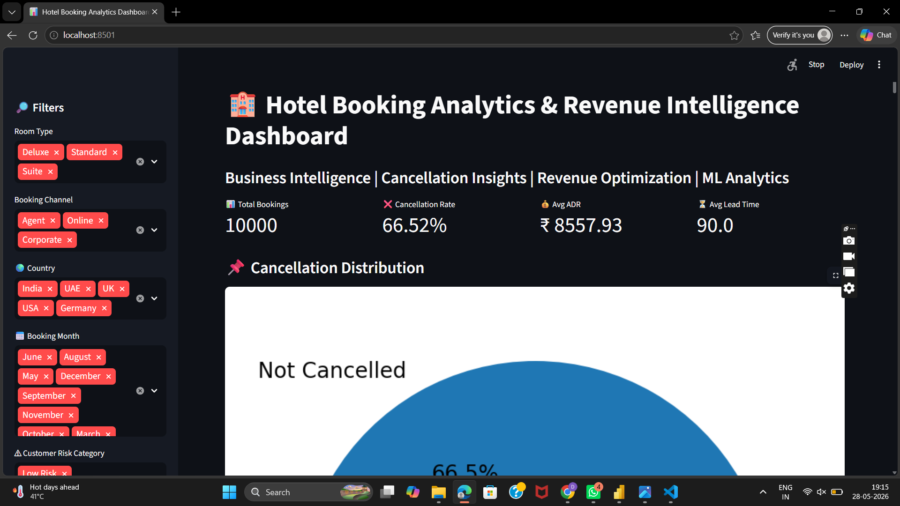

# Hotel Booking Analysis Dashboard

## Project Overview

This project focuses on analyzing hotel booking data to uncover customer behavior, booking trends, cancellation patterns, and revenue insights. The dashboard helps businesses understand booking performance and improve decision-making using data analytics and visualization techniques.

The project was developed using Python, Power BI, and Streamlit for interactive analytics and visualization.

---

# Objectives

- Analyze hotel booking trends
- Study cancellation patterns
- Identify customer preferences
- Monitor revenue performance
- Visualize booking insights using dashboards
- Build interactive analytics reports

---

# Tools & Technologies Used

- Python
- Pandas
- NumPy
- Matplotlib
- Seaborn
- Power BI
- Streamlit
- Jupyter Notebook

---

# Dataset Features

The dataset contains hotel booking information such as:

- Hotel Type
- Booking Date
- Customer Country
- Lead Time
- Number of Adults
- Number of Children
- Meal Type
- Room Type
- Reservation Status
- Booking Cancellation
- ADR (Average Daily Rate)
- Market Segment

---

# Key Analysis Performed

## Booking Analysis
- Total bookings analysis
- Monthly booking trends
- Customer distribution by country
- Hotel type comparison

## Cancellation Analysis
- Cancellation rate analysis
- Lead time impact on cancellations
- Booking status insights

## Revenue Analysis
- ADR analysis
- Revenue trends
- Customer spending patterns

---

# Dashboard Features

## Power BI Dashboard Includes:
- Total Bookings KPI
- Cancellation Rate
- Revenue Analysis
- Country-wise Booking Distribution
- Monthly Booking Trends
- ADR Analysis
- Hotel Type Comparison
- Interactive Filters & Slicers

---

# Streamlit Dashboard Features

- Interactive booking analysis
- Dynamic filtering options
- Real-time chart visualization
- KPI metrics
- Booking trend analysis

---

# Project Workflow

1. Data Collection
2. Data Cleaning
3. Exploratory Data Analysis
4. Booking Trend Analysis
5. Cancellation Analysis
6. Dashboard Development
7. Business Insights Generation

---

# Key Insights

- Identified peak booking seasons
- Analyzed major cancellation factors
- Compared city and resort hotel performance
- Observed customer booking behavior patterns
- Evaluated ADR and revenue trends

---

# Business Impact

- Helps hotels optimize booking strategies
- Supports revenue management decisions
- Improves customer experience analysis
- Enhances business reporting with interactive dashboards

---

# Future Improvements

- Machine Learning-based booking prediction
- Customer recommendation system
- Real-time hotel analytics dashboard
- Deployment using cloud services

---

## Dashboard Preview

### Power BI Dashboard

### Streamlit Dashboard

---

# Author

## Diksha Katyal
Data Analytics & Visualization Project
